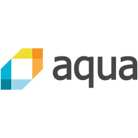
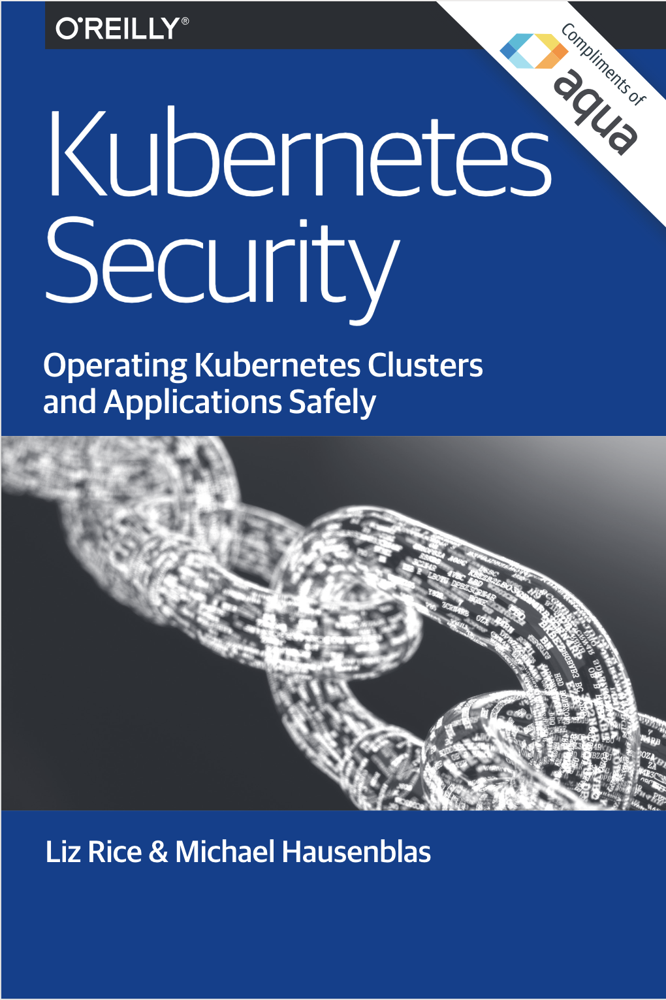

# Introduction to Containers for Go Programmers

This workshop is designed to help Go programmers get a solid understanding of containers. During the course of this workshop you will do practical exercises that introduce you to tools like Docker, Kubernetes, and Skaffold. I hope these practical skills will be useful, but even more importantly the intention is to give you a solid understanding of what is happening when you use them. Sometimes technology feels like magic, but we can use it more effectively and powerfully if we look behind the curtain and learn how the magic trick is put together.

If you have already used tools like Docker and Kubernetes before, some of this material will be very familiar to you. If you have extra time there are additional exercises and further reading to keep you busy.

_This workshop is supported by [Aqua Security](https://www.aquasec.com), the enterprise platform for cloud native security._

## What does this course cover?

This course answers the following questions.

* What are containers, and why do we use them?
* How do I build software - particularly Go software - into containers?
* How do containers connect together?
* How do I run my Go software under Kubernetes?
* What are the security risks running containers, and what can I do to avoid them?

You’ll also hear about some interesting features of Linux that make containers possible.

During the workshop we will have some interactive sessions, some presentations, and time to work through the [workshop scenarios](https://www.katacoda.com/lizrice/training/containers-and-go) at your own pace. This page will help you get orientated.

## Why is this workshop for Go programmers?

A lot of this material is relevant whatever language you use, but it assumes basic familiarity with Go.

* The example code uses Go
* There are scenarios that focus on container images optimized for standalone binary executables - you can't do quite the same thing if you have a scripted language or need lots of dependencies available at runtime

## Before the workshop

You can run nearly all the scenarios on [Katacoda](https://www.katacoda.com), a training platform that gives you an online environment where you can easily work through the examples. You will just need an internet connection for this.

There are some optional exercises you can run if you have Docker installed on your laptop, so please [install Docker](https://docker.com) and create a free account on [Docker Hub](https://hub.docker.com) before you attend the session.

## Need help?

If you're at a workshop we are here to help! You can ask any of the trainers for assistance. You can also ask for help in the [Gitter community](https://gitter.im/containers-and-go/community) for this workshop.

## Agenda

### Part 1 - What containers are

* Discussion: what are containers?
* Container basics: containers and images
* What's inside a container image?
* Entrypoints and commands (optional)

### Part 2 - What containers _really_ are

* Demo: containers are made from namespaces, chroot and cgroups
* Write a container from scratch yourself

### Part 3 - Containers for Go apps

 

* Go apps and multistage builds
* Vulnerability scanning for containers
* Skaffold

### Part 4 - Intro to Kubernetes

* Why orchestration?
* Try Kubernetes
* Intro to Kubernetes Security 

You can download a digital copy of _Kubernetes Security_ [here](https://info.aquasec.com/kubernetes-security)
